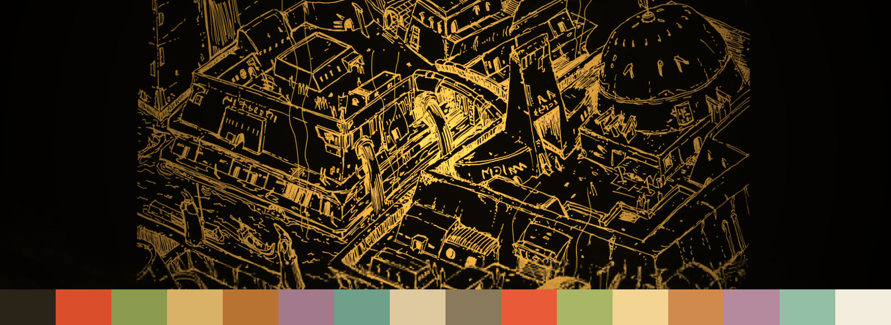

<div align="center">

# 🏛️ Morrowind — an Omarchy theme

**Ashen golds, volcanic reds, and weathered parchment.**
A warm, atmospheric [Omarchy](https://omarchy.org/) theme inspired by *The Elder Scrolls III: Morrowind* — shipped in a dark edition and a light **Parchment** variant.



<sub>Signature wallpaper + the theme's 16-color palette. Desktop screenshots welcome — see [docs/screenshots](docs/screenshots/).</sub>

</div>

---

## ✨ Features

- **Two editions** — **Morrowind** (dark, ashen) and **Morrowind Parchment** (light vellum).
- **Fully integrated** — colors flow through your terminal, Quickshell/Waybar, `btop`, `walker`, `mako`, `hyprlock`, and Neovim from a single `colors.toml`.
- **Curated wallpapers** — hand-picked etchings and vistas in `backgrounds/`.
- **Native install** — one-line install via Omarchy's theme manager.
- **Optional themed lock screen** — a matching Quickshell lock (opt-in, fully reversible).
- **Optional Quickshell desktop suite** — a themed audio visualizer (a *Telvanni living-membrane* spectrum), app launcher, power menu, and workspace overview. Each is opt-in and reverses byte-for-byte.
- **Zero lock-in** — pure Omarchy theme; no compositor plugins, no system rewrites.

## 🎨 Palette

| Role | Dark | Parchment |
|------|------|-----------|
| Background | `#14100A` ash-black | light vellum |
| Foreground | `#CAA560` weathered gold | dark ink |
| Accent | `#D9B167` gold | copper/gold |
| Red | `#DA4F2B` Red-Mountain ember | — |
| Green | `#8A9A4E` kwama moss | — |

See `colors.toml` for the full 16-color set.

---

## 🚀 Install

### Option A — Omarchy native (recommended, one line)

```bash
omarchy theme install https://github.com/Mhsbrian/omarchy-morrowind-theme.git
```

Installs the **Morrowind (dark)** theme and applies it. Done.

### Option B — Script (adds the Parchment variant, lock screen, and/or Quickshell suite)

```bash
git clone https://github.com/Mhsbrian/omarchy-morrowind-theme.git
cd omarchy-morrowind-theme

./install.sh                    # dark theme
./install.sh --parchment        # + light variant
./install.sh --with-shell       # + visualizer, launcher, power menu, overview
./install.sh --all              # everything (variant + lock screen + Quickshell suite)
```

Pick individual extras with `--with-visualizer`, `--with-launcher`, `--with-power`,
`--with-overview`, or `--with-lockscreen`. Run `./install.sh --help` for the full list.

Then apply:

```bash
omarchy theme set "Morrowind"            # or "Morrowind Parchment"
```

Preview any run with `--dry-run`. Full details in [docs/INSTALLATION.md](docs/INSTALLATION.md).

## 🗑️ Uninstall

```bash
./uninstall.sh                       # remove both editions
./uninstall.sh --with-lockscreen     # also restore the default hyprlock flow
./uninstall.sh --with-shell          # also remove the Quickshell suite
```

Removes only what was installed; every keybind, autostart entry, and config edit
is reversed byte-for-byte (verified against a throwaway home).

---

## 📦 What's in the box

```
colors.toml, hyprland.conf, hyprlock.conf, mako.ini, walker.css,
btop.theme, neovim.lua, icons.theme, backgrounds/   ← the Morrowind theme (repo root)
variants/morrowind-parchment/                       ← light variant
extras/lockscreen/                                  ← optional Quickshell lock + scripts
extras/quickshell/                                  ← optional suite: visualizer, launcher,
                                                       power, overview, shared theme-fx/
install.sh · uninstall.sh · lib/                    ← installer
docs/                                               ← guides & screenshots
```

## 🔧 Customize

Tweak `colors.toml` and re-apply — everything downstream re-themes automatically.
Recipes (swapping wallpapers, adjusting the bar accent, editing the palette) are
in [docs/CUSTOMIZATION.md](docs/CUSTOMIZATION.md).

## 🔒 Optional lock screen

`--with-lockscreen` installs a themed Quickshell lock that replaces `hyprlock`.
It's **invasive** (edits `hypridle.conf`, rebinds `SUPER+CTRL+L`) but fully
reversible, keeps `hyprlock` as a fallback, and backs up your config first.
Test it once at your keyboard (`SUPER+CTRL+L`) before relying on the idle lock.
See [docs/INSTALLATION.md](docs/INSTALLATION.md#optional-lock-screen).

## 🖥️ Optional Quickshell desktop suite

`--with-shell` installs four themed, standalone Quickshell components. Each reads
the active theme's `colors.toml` and adapts, adds a keybind + an autostart entry
(marker-managed, fully reversible), and starts immediately:

| Component | Keybind | What it is |
|-----------|---------|------------|
| **Audio visualizer** | `SUPER+M` | A bottom-edge `cava` spectrum. On Morrowind it renders as a *Telvanni living membrane* — a single luminous emerald ridge that ripples with the music. Needs [`cava`](https://github.com/karlstav/cava). |
| **App launcher** | `SUPER+Space` (also `SUPER+D`) | Fuzzy application search with icons. Overrides Omarchy's `walker` launcher. Needs `python3`. |
| **Power menu** | `SUPER+Escape` | Lock / suspend / log out / restart / shut down. Overrides Omarchy's system menu. |
| **Workspace overview** | `SUPER+E` | A live mini-map of every workspace and its windows. |

Install them together with `--with-shell`, or cherry-pick individual flags. The
four share a small `theme-fx/` shader directory (installed once, pruned on
uninstall once nothing else needs it). Remove with `./uninstall.sh --with-shell`.

## 📋 Requirements

Omarchy (Hyprland). The optional lock screen and Quickshell suite additionally
need `quickshell` and `~/.local/bin` on your `$PATH` (Omarchy's default); the
**visualizer** needs `cava` and the **launcher** needs `python3`.

## 📜 License

[MIT](LICENSE). Inspired by *The Elder Scrolls III: Morrowind*; no game assets
are redistributed. "Morrowind" and *The Elder Scrolls* are trademarks of
ZeniMax Media — this is an unofficial, fan-made color theme.
